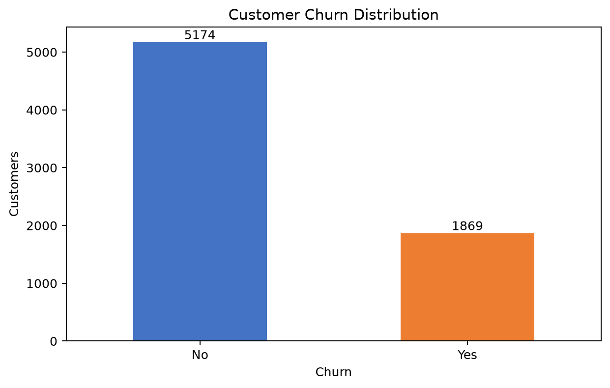
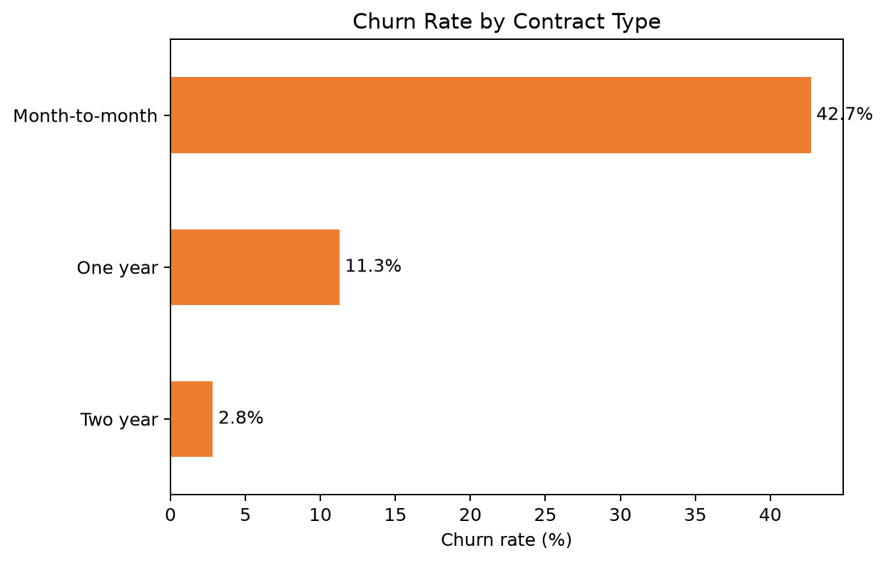
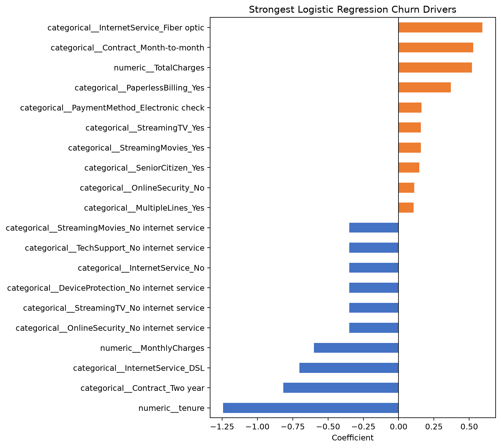

# Customer Churn Prediction Using Machine Learning

An end-to-end analysis of the IBM Telco Customer Churn dataset. The project cleans customer data, explores churn patterns, trains an interpretable logistic regression model, evaluates its performance, and converts the findings into practical retention recommendations.

## Live demo

Try the deployed prediction app here: [Customer Churn Prediction App](https://customer-churn-prediction-using-machine-learning-8u58yeufi66lk.streamlit.app/)

## Project workflow

1. Load and validate the customer dataset.
2. Convert `TotalCharges` to numeric and resolve its blank values.
3. Explore churn across contracts, internet services, payment methods, tenure, and charges.
4. Split the data into stratified training and test sets.
5. Scale numeric fields and one-hot encode categorical fields.
6. Train a logistic regression classifier.
7. Evaluate accuracy, precision, recall, ROC-AUC, and the confusion matrix.
8. Save the model, customer risk scores, charts, and business recommendations.

## Repository structure

```text
app.py                 Streamlit customer churn prediction app
data/                  Original IBM dataset
docs/                  Demo script, blog post, and interview practice notes
src/churn_analysis.py  Complete analysis and modeling workflow
outputs/               Generated report, charts, metrics, predictions, and model
DEPLOYMENT.md          Deployment instructions for the app
requirements.txt       Python dependencies
```

## Key visualizations

These charts are included in the README so lecturers, recruiters, or reviewers can understand the project quickly without running the code.

### Churn distribution



### Contract type vs churn



### Top churn factors



## Run the project

From the project folder in the VS Code terminal:

```bash
python -m pip install -r requirements.txt
python src/churn_analysis.py
```

The generated files will appear in `outputs/`. The main written findings are in `outputs/analysis_report.md`, while the reusable trained pipeline is saved under `outputs/model/`.

## Run the prediction app

After running the analysis script, launch the interactive Streamlit app:

```bash
streamlit run app.py
```

The app allows a user to enter a customer profile and returns a churn prediction, churn probability, risk level, and suggested retention action.

## Deployment and presentation materials

This project includes extra materials for presenting the work professionally:

- `DEPLOYMENT.md`: instructions for deploying the Streamlit app.
- `docs/demo_video_script.md`: short demo-video script.
- `docs/technical_blog_post.md`: technical blog post explaining the project and statistical methods.
- `docs/interview_practice.md`: interview questions and example answers.

## Methodology

The model excludes `customerID`, uses an 80/20 stratified train/test split, and fits all preprocessing only on the training data. Numeric values are median-imputed and standardized. Categorical values are mode-imputed and one-hot encoded. A fixed random seed makes the reported result reproducible.

## Model limitations

The model uses Logistic Regression, which is interpretable but assumes a mostly linear relationship between the predictors and the log-odds of churn. The default probability threshold of 0.5 gives balanced overall performance, but it still misses some customers who eventually churn. Future improvements could include threshold tuning, class imbalance techniques, additional feature engineering, or comparing stronger models such as Random Forest and Gradient Boosting.

## Responsible use

Predictions should prioritize helpful retention outreach, not denial of service or unfavorable treatment. Before production use, validate the model on recent company data, review performance across customer groups, select a probability threshold based on campaign costs, and monitor drift.
